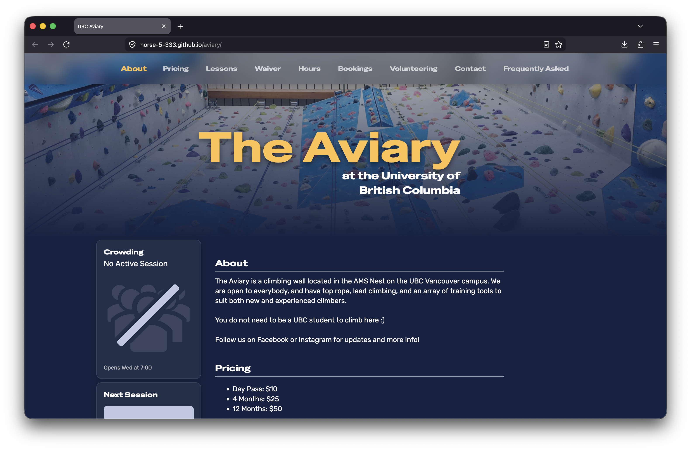
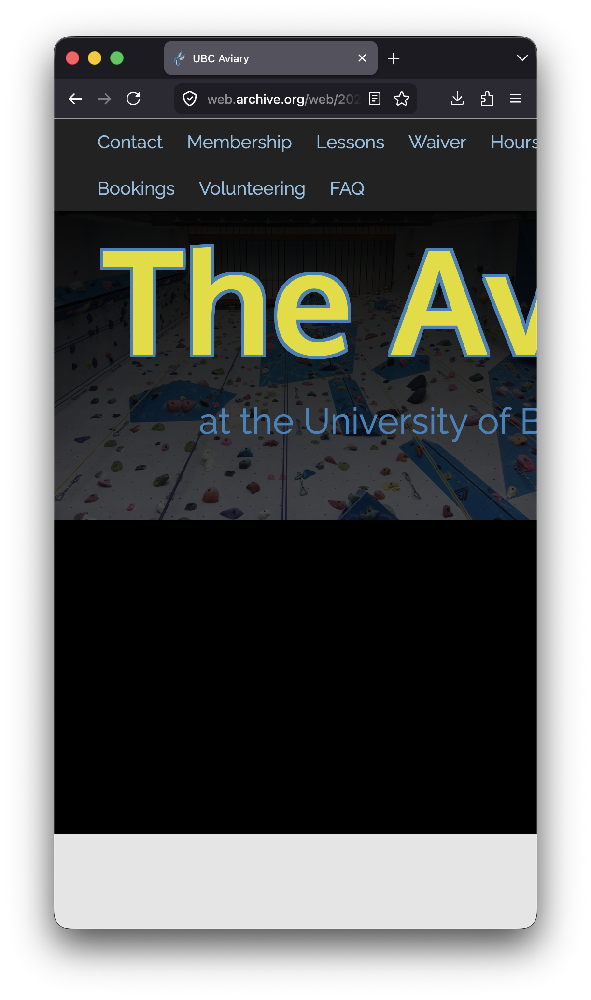
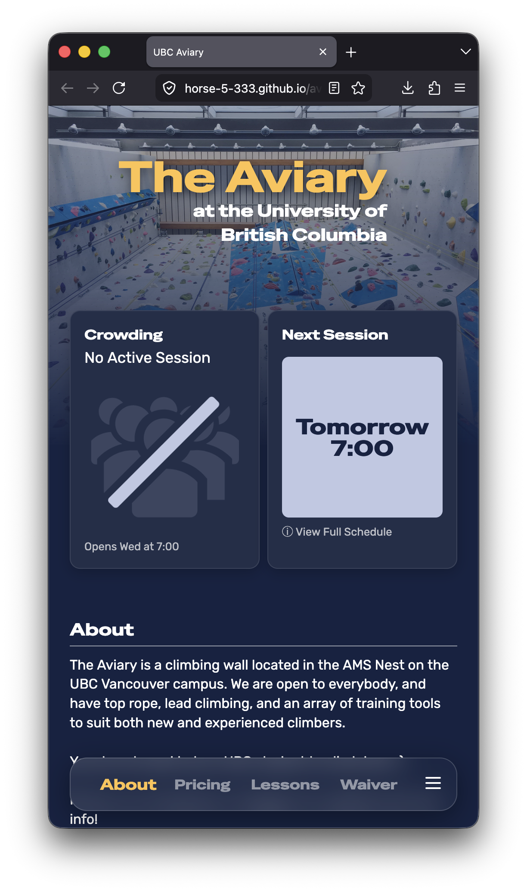
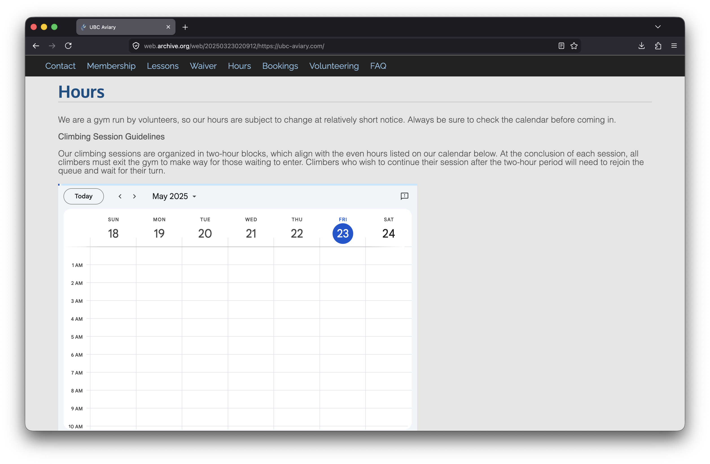
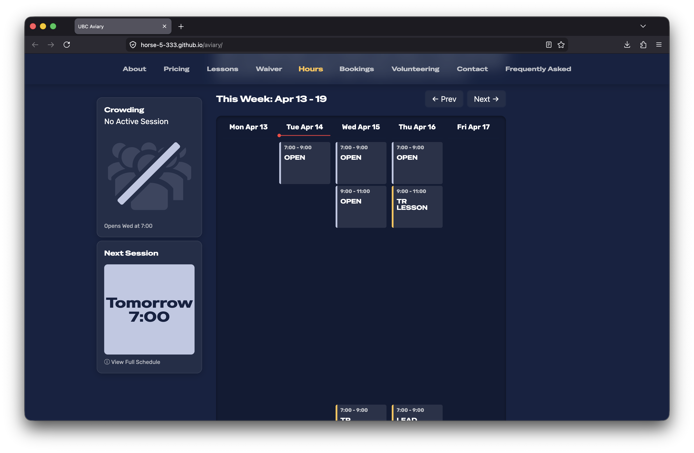
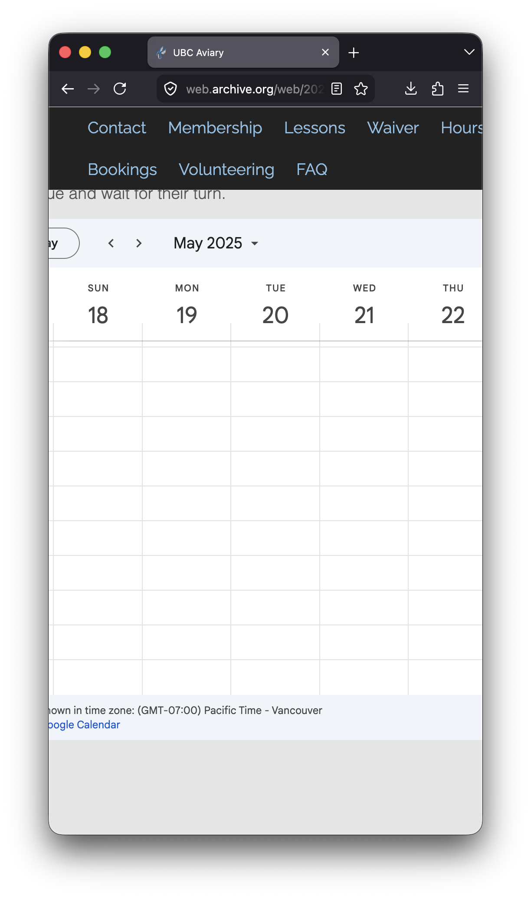
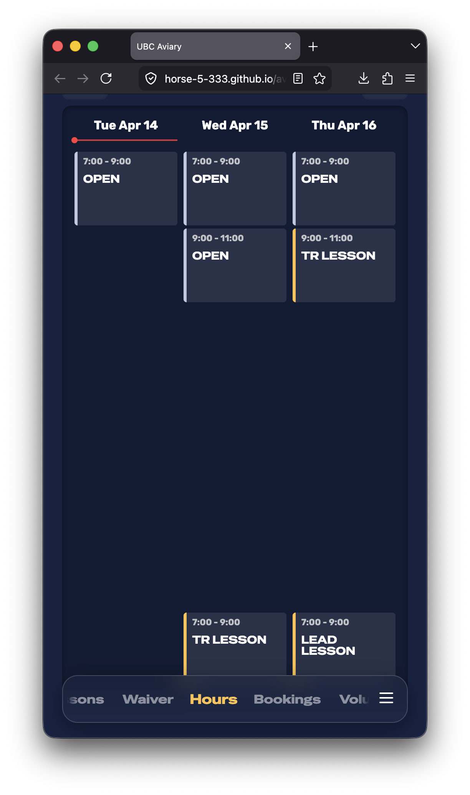
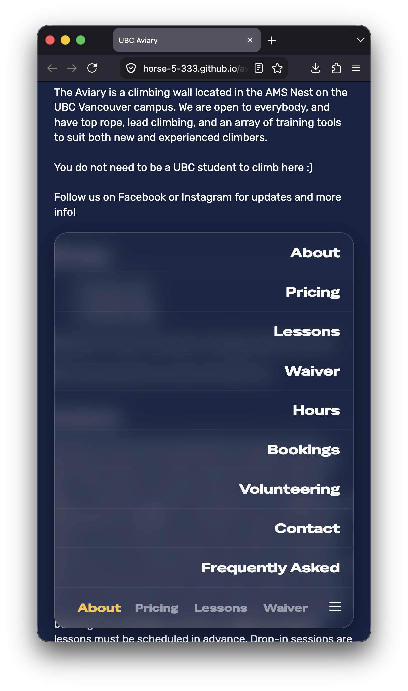

# The Aviary — Website Redesign

A full redesign of [The Aviary](https://ubc-aviary.com)'s website, a volunteer-run 
climbing gym at UBC. Built unsolicited, pitched to and reviewed by the club president, 
after identifying their existing site as outdated and broken on mobile.

Live demo: https://horse-5-333.github.io/aviary

## What's new

- **Custom schedule renderer** — parses The Aviary's public Google Calendar feed and 
  renders a fully custom weekly view with swipe/scroll navigation, replacing the 
  original embedded Google Calendar widget
- **Mobile-first redesign** — the original site was unusable on mobile; the new version 
  is designed for it first, with a sticky bottom nav and responsive layouts throughout
- **Crowding & session widget** — live display of current gym capacity and next 
  upcoming session surfaced directly on the landing page
- **backdrop-filter blur** — modern CSS for hero overlay rendering
- Webpack build pipeline with dev/prod configs

## Comparisons

| | Old site | New site |
|---|---|---|
| Desktop landing |  |  |
| Mobile landing |  |  |
| Schedule (desktop) |  |  |
| Schedule (mobile) |  |  |

### New Mobile Nav Menu

